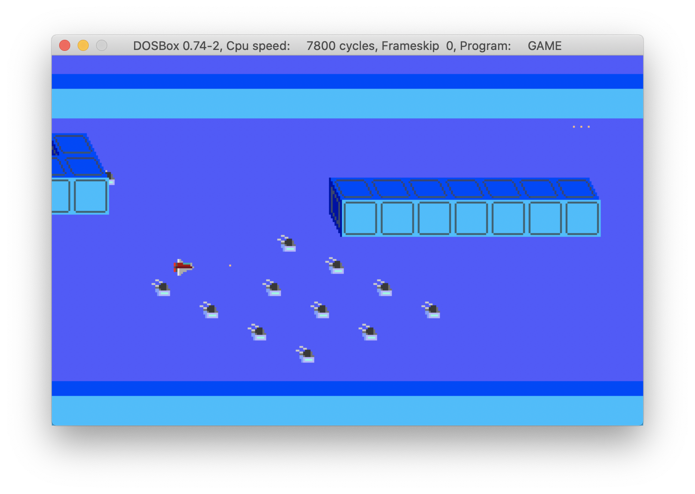
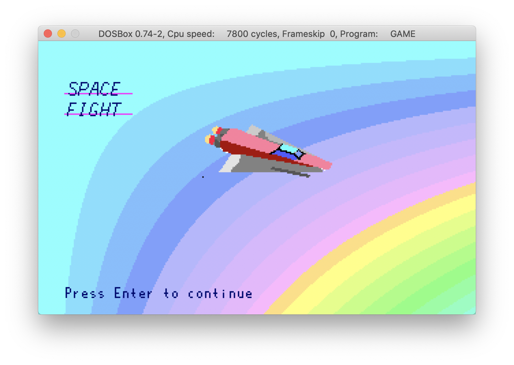
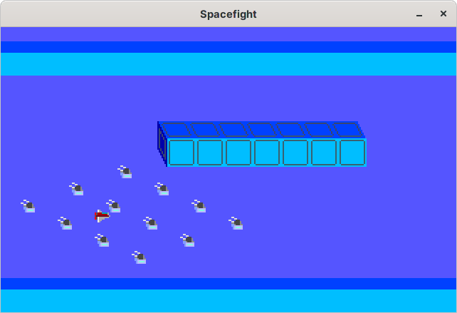

Spacefight
----------

Space Fight is a DOS game in Development.
It is written in C and is using VGA graphics (mode13h)

The program is build using the watcom compiler toolchain (v. 1.97).

## Update: Game is now cross platform!

There's new custom code, which enables the game to run on almost any modern platform using 
the [Raylib-Enginge](https://www.raylib.com). 

What you need is:

* the Raylib Library

and when compiling, it might be necessary to specify the correct Makefile as follows:

`make -f GNUmakefile`

Tested on macOS 11 and Manjaro Linux.

